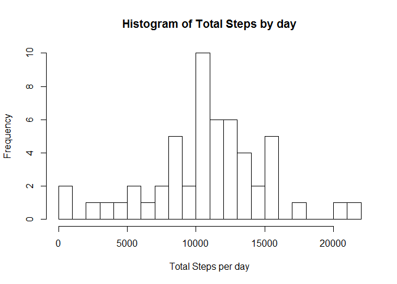
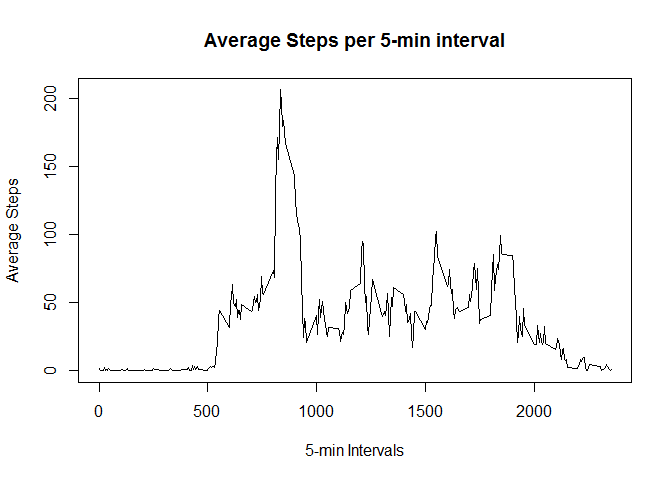
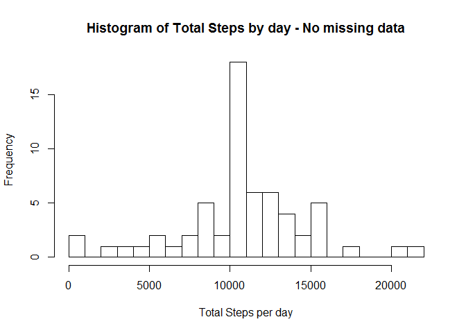
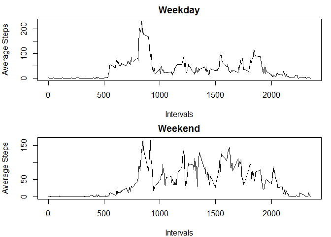

> > Loading and preprocessing the data

Download zip file & save in current working directory

    if(!file.exists("./data")){dir.create("./data")}
    if(!file.exists("./data/Dataset.zip")){
    download.file("https://d396qusza40orc.cloudfront.net/repdata%2Fdata%2Factivity.zip",destfile="./data/Dataset.zip")
    }

Unzip dataSet to /data directory

    if(!file.exists("./data/activity.csv")){
    unzip(zipfile="./data/Dataset.zip",exdir="./data")
    }

Read activity dataset

    activity_data<-read.csv("./data/activity.csv")

> > What is mean total number of steps taken per day?

Calculate the total number of steps taken per day.

    Total_Steps_per_day <- aggregate(steps ~ date, activity_data, sum)

If you do not understand the difference between a histogram and a
barplot, research the difference between them. Make a histogram of the
total number of steps taken each day

    hist1<-hist(Total_Steps_per_day$steps, xlab = "Total Steps per day", main="Histogram of Total Steps by day", breaks=seq(0,22000,1000))

    hist1

    ## $breaks
    ##  [1]     0  1000  2000  3000  4000  5000  6000  7000  8000  9000 10000
    ## [12] 11000 12000 13000 14000 15000 16000 17000 18000 19000 20000 21000
    ## [23] 22000
    ## 
    ## $counts
    ##  [1]  2  0  1  1  1  2  1  2  5  2 10  6  6  4  2  5  0  1  0  0  1  1
    ## 
    ## $density
    ##  [1] 3.773585e-05 0.000000e+00 1.886792e-05 1.886792e-05 1.886792e-05
    ##  [6] 3.773585e-05 1.886792e-05 3.773585e-05 9.433962e-05 3.773585e-05
    ## [11] 1.886792e-04 1.132075e-04 1.132075e-04 7.547170e-05 3.773585e-05
    ## [16] 9.433962e-05 0.000000e+00 1.886792e-05 0.000000e+00 0.000000e+00
    ## [21] 1.886792e-05 1.886792e-05
    ## 
    ## $mids
    ##  [1]   500  1500  2500  3500  4500  5500  6500  7500  8500  9500 10500
    ## [12] 11500 12500 13500 14500 15500 16500 17500 18500 19500 20500 21500
    ## 
    ## $xname
    ## [1] "Total_Steps_per_day$steps"
    ## 
    ## $equidist
    ## [1] TRUE
    ## 
    ## attr(,"class")
    ## [1] "histogram"

Calculate and report the mean and median of the total number of steps
taken per day.

    mean(Total_Steps_per_day$steps)

    ## [1] 10766.19

    median(Total_Steps_per_day$steps)

    ## [1] 10765

    summary(Total_Steps_per_day$steps)

    ##    Min. 1st Qu.  Median    Mean 3rd Qu.    Max. 
    ##      41    8841   10765   10766   13294   21194

> > What is the average daily activity pattern?

Make a time series plot (i.e. type = "l") of the 5-minute interval
(x-axis) and the average number of steps taken, averaged across all days
(y-axis).

    Average_Steps_every_5min_interval <- aggregate(steps ~ interval, activity_data, mean)
    plot(Average_Steps_every_5min_interval,type = "l",xlab = "5-min Intervals", ylab = "Average Steps",main = "Average Steps per 5-min interval")

Which 5-minute interval, on average across all the days in the dataset,
contains the maximum number of steps?

    Average_Steps_every_5min_interval[which.max(Average_Steps_every_5min_interval$steps),]

    ##     interval    steps
    ## 104      835 206.1698

> > Imputing missing values

Calculate and report the total number of missing values in the dataset
(i.e. the total number of rows with NAs).

    sapply(X = activity_data, FUN = function(x) sum(is.na(x)))

    ##    steps     date interval 
    ##     2304        0        0

Devise a strategy for filling in all of the missing values in the
dataset. The strategy does not need to be sophisticated. For example,
you could use the mean/median for that day, or the mean for that
5-minute interval, etc. Find indices of all missing values

    na_index<-which(is.na(activity_data))
    summary(na_index)

    ##    Min. 1st Qu.  Median    Mean 3rd Qu.    Max. 
    ##       1    7273   10656    9324   12024   17568

Calculate average steps in the 5-min interval across all days

    Average_Steps_every_5min_interval <- aggregate(steps ~ interval, activity_data, mean)

Create new data set & replace NA values with average steps in the 5-min
interval across all days

    new_activity_data <- activity_data
    for(i in 1:length(na_index)){
        new_activity_data[na_index[i],]$steps <- Average_Steps_every_5min_interval[which(Average_Steps_every_5min_interval$interval==activity_data[na_index[i],]$interval),]$steps
    }

Check for any missing values in the new dataset

    summary(which(is.na(new_activity_data)))

    ##    Min. 1st Qu.  Median    Mean 3rd Qu.    Max. 
    ## 

Make a histogram of the total number of steps taken each day

    New_Total_Steps_per_day <- aggregate(steps ~ date, new_activity_data, sum)
    hist2<-hist(New_Total_Steps_per_day$steps, xlab = "Total Steps per day", main="Histogram of Total Steps by day - No missing data", breaks=seq(0,22000,1000))

    hist2

    ## $breaks
    ##  [1]     0  1000  2000  3000  4000  5000  6000  7000  8000  9000 10000
    ## [12] 11000 12000 13000 14000 15000 16000 17000 18000 19000 20000 21000
    ## [23] 22000
    ## 
    ## $counts
    ##  [1]  2  0  1  1  1  2  1  2  5  2 18  6  6  4  2  5  0  1  0  0  1  1
    ## 
    ## $density
    ##  [1] 3.278689e-05 0.000000e+00 1.639344e-05 1.639344e-05 1.639344e-05
    ##  [6] 3.278689e-05 1.639344e-05 3.278689e-05 8.196721e-05 3.278689e-05
    ## [11] 2.950820e-04 9.836066e-05 9.836066e-05 6.557377e-05 3.278689e-05
    ## [16] 8.196721e-05 0.000000e+00 1.639344e-05 0.000000e+00 0.000000e+00
    ## [21] 1.639344e-05 1.639344e-05
    ## 
    ## $mids
    ##  [1]   500  1500  2500  3500  4500  5500  6500  7500  8500  9500 10500
    ## [12] 11500 12500 13500 14500 15500 16500 17500 18500 19500 20500 21500
    ## 
    ## $xname
    ## [1] "New_Total_Steps_per_day$steps"
    ## 
    ## $equidist
    ## [1] TRUE
    ## 
    ## attr(,"class")
    ## [1] "histogram"

Calculate and report the mean and median total number of steps taken per
day. Do these values differ from the estimates from the first part of
the assignment? What is the impact of imputing missing data on the
estimates of the total daily number of steps?

    mean(New_Total_Steps_per_day$steps)

    ## [1] 10766.19

    median(New_Total_Steps_per_day$steps)

    ## [1] 10766.19

    summary(New_Total_Steps_per_day$steps)

    ##    Min. 1st Qu.  Median    Mean 3rd Qu.    Max. 
    ##      41    9819   10766   10766   12811   21194

> > Are there differences in activity patterns between weekdays and
> > weekends?

Create a new factor variable in the dataset with two levels - "weekday"
and "weekend" indicating whether a given date is a weekday or weekend
day.

    new_activity_data$WeekendOrWeekday <- ifelse(weekdays(as.Date(new_activity_data$date)) %in% c("Sunday", "Saturday"), "Weekend", "Weekday")

Make a panel plot containing a time series plot (i.e. type = "l") of the
5-minute interval (x-axis) and the average number of steps taken,
averaged across all weekday days or weekend days (y-axis). See the
README file in the GitHub repository to see an example of what this plot
should look like using simulated data.

Create subsets of weekend & weekday datasets

    new_activity_data_Weekend <- new_activity_data[which(new_activity_data$WeekendOrWeekday=="Weekend"),]
    new_activity_data_Weekday <- new_activity_data[which(new_activity_data$WeekendOrWeekday=="Weekday"),]

Calculate average steps in the 5-min interval across all days for
weekend and weekday datasets

    Average_Steps_every_5min_interval_Weekend <- aggregate(steps ~ interval, new_activity_data_Weekend, mean)
    Average_Steps_every_5min_interval_Weekday <- aggregate(steps ~ interval, new_activity_data_Weekday, mean)

Plot the average number of steps taken, averaged across all weekday days
or weekend days

    par(mfrow=c(2,1),mar=c(4,4,2,1))
    plot(Average_Steps_every_5min_interval_Weekday,type = "l",xlab = "Intervals",
         ylab = "Average Steps",main = "Weekday")
    plot(Average_Steps_every_5min_interval_Weekend,type = "l",xlab = "Intervals",
         ylab = "Average Steps",main = "Weekend")

